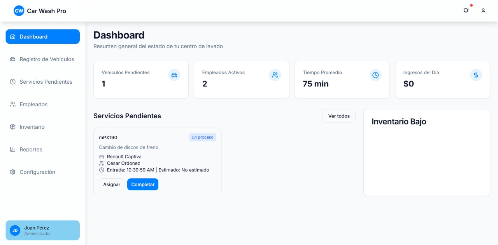

# Vehicle Spruce System

## Descripción
Una aplicación completa para la gestión de talleres mecánicos que permite administrar órdenes de trabajo, inventario, clientes, vehículos y empleados.



## Aplicación en vivo
Puedes acceder a la aplicación desplegada en: [https://vehicle-spruce-frontend.onrender.com](https://vehicle-spruce-frontend.onrender.com)

## Características principales
- **Dashboard** con estadísticas y resumen de actividades
- **Registro de vehículos** y asociación con clientes
- **Gestión de servicios** pendientes y en progreso
- **Control de inventario** con alertas de stock bajo
- **Administración de empleados** y asignación de tareas
- **Generación de reportes** y estadísticas

## Tecnologías utilizadas
- React con TypeScript
- Vite como bundler
- Tailwind CSS para estilos
- Shadcn/UI para componentes
- React Query para manejo de estado y peticiones
- React Router para navegación
- Axios para comunicación con API

## Instalación local

1. Clona el repositorio:
```bash
git clone https://github.com/SebastianOrdonezGiraldo/vehicle-spruce-sys.git
```

2. Instala las dependencias:
```bash
npm install
```

3. Crea un archivo `.env.local` con la configuración de la API:
```
VITE_API_URL=https://carwash-backend-hrpl.onrender.com/api
```

4. Inicia el servidor de desarrollo:
```bash
npm run dev
```

## Despliegue
El frontend está desplegado en [Render](https://render.com) como un Static Site.
El backend está disponible en: [https://carwash-backend-hrpl.onrender.com](https://carwash-backend-hrpl.onrender.com)

## Estructura del proyecto
- `/src/api`: Funciones para comunicación con el backend
- `/src/components`: Componentes reutilizables
- `/src/hooks`: Hooks personalizados
- `/src/pages`: Páginas principales de la aplicación
- `/src/services`: Servicios para operaciones de backend

## Contribución
1. Haz fork del proyecto
2. Crea una nueva rama (`git checkout -b feature/amazing-feature`)
3. Haz commit de tus cambios (`git commit -m 'Add some amazing feature'`)
4. Haz push a la rama (`git push origin feature/amazing-feature`)
5. Abre un Pull Request

## Autor
Sebastian Ordoñez Giraldo

## Licencia
ISC